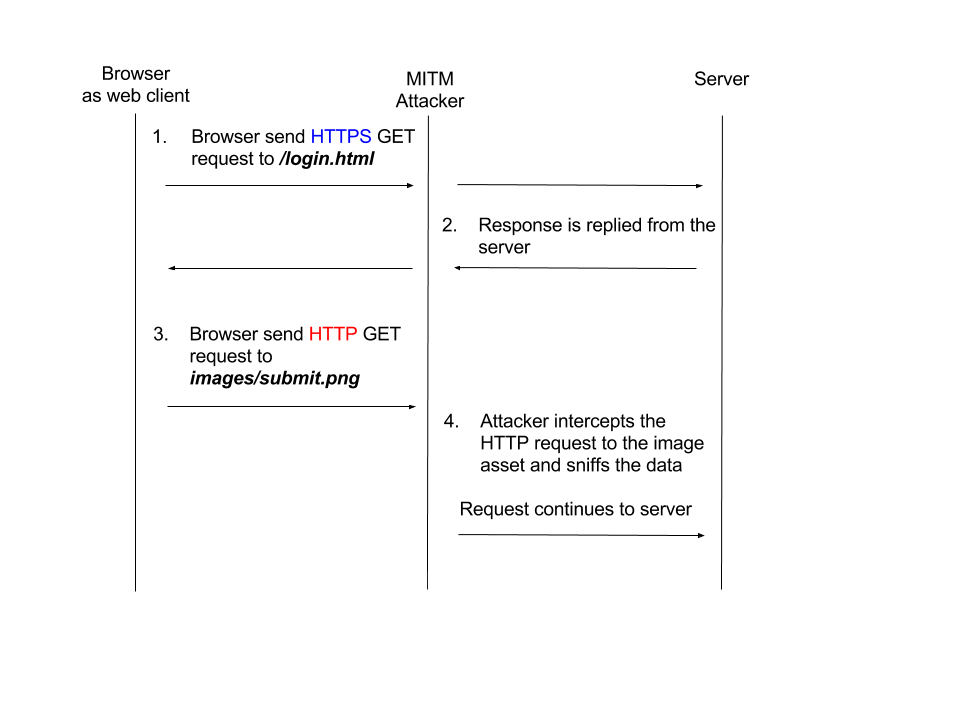

# HTTP Headers Security

Developing web applications means that our app depends on communication protocols which already have a set of standards defined and implemented for how to transfer data and how to manage it in a secure manner.

Browsers utilize headers sent over HTTP (secure HTTP connections mostly) to enforce and confirm such communication standards as well as security policies. Making use of these HTTP headers to increase security for the code running on the browser client-side is a quick and efficient method to mitigate security vulnerabilities and add defense in depth.

## Security Headers Caveats

Utilizing security headers can be a great strategy to help prevent security vulnerabilities but a common mistake is to rely on them solely to mitigate such issues. This is because responding to a request with a security header depends on the browser to actually support, implement and adhere to the specification to enforce it. You may consult the [Strict Transport Security browser compatibility matrix](https://caniuse.com/#feat=stricttransportsecurity) to verify if the browsers used for your web application are supported.

As such, security headers should be used as a defense in depth security mechanism that helps in adding a security control, but they shouldn't be the actual security control to defend against vulnerabilities like Cross-site Scripting.

## Node.js Packages for HTTP Security Headers

Responding to requests with security related HTTP headers is an HTTP concern and as such,
it may be employed with any web framework, or with the basic core http or https modules
which Node.js provide.

The [Helmet](https://github.com/helmetjs/helmet) library provides an easy abstraction,
and configuration for the various HTTP security headers that should be used and makes an
excellent choice for Node.js web applications based on Express.

### Helmet

[Helmet](https://github.com/helmetjs/helmet) is an application-level middleware for ExpressJS, providing widespread support for HTTP security headers, such as `X-XSS-Protection` to mitigate various browser related Cross-Site-Scripting (XSS) security vulnerabilities, X-Frame-Options protection and many others.

Helmet, being a collection of middleware functions for increased HTTP headers security, is well maintained and kept up to date. As such, it makes it a good choice to incorporate in your
Node.js web applications.

I> # More on Helmet
I>
I> Helmet has been around since 2012 and is considered mature and production-ready with stable releases and adoption by many frameworks and Node.js projects.
I> It is mainly developed by Evan Hahn, and Adam Baldwin who maintain hundreds of npm packages in the registry between them.

Helmet works by introducing middleware functions for ExpressJS that reply to incoming requests with a set of headers.

{pagebreak}

## Strict Transport Security

Strict Transport Security, also known as HSTS, is a protocol standard to enforce secure connections to the server via HTTP over SSL/TLS. HSTS is configured and transmitted from the server to any HTTP web client using the HTTP header _Strict-Transport-Security_ which specifies a time interval during which the browser should only communicate over an HTTP secured connection (HTTPS).

T> ## Tip
T>
T> When a _Strict-Transport-Security_ header is sent over an insecure HTTP connection the web browser ignores it because the connection is insecure to begin with.

In future requests after the header has been set, the browser consults a preload service, such as [that of Google's](https://hstspreload.org/), in order to determine whether to website has opt-ed in for HSTS.

### The Risk

The risks that may arise when communicating over a secure HTTPS connection is that a malicious user can perform a Man-In-The-Middle (MITM) attack and down-grade future requests to the web server to use an HTTP connection, thus being able to sniff and read all the data that flows through.

I> ## Interesting fact:
I> The [original HSTS draft](https://tools.ietf.org/html/rfc6797) was published in 2011 by Jeff Hodges from PayPal,
I> Collin Jackson from Carnegie Mellon University, and Adam Barth from Google.
I>

Sending insecure HTTP requests to the web server, even though an HTTPS connection was initially made is not a problem on its own, as the user is unaware of why this is happening and wouldn't necessarily suspect a MITM attack. Perhaps the server has a REST endpoint which does not yet support HTTPS.

In the following flow diagram, _Figure 1-1_, we can see an example scenario where the server returns an HTML file for the login page to the browser, which includes some resources that are accessible over HTTP (`http://cdn.server.com/images/submit.png`), like the submit button's image.

If an attacker is able to perform a Man-In-The-Middle attack and "sit on the wire" to listen and sniff any un-encrypted traffic that flows through, then they can access and read those HTTP requests which may include sensitive data. Even worse scenarios may include HTTP resources set for POST or PUT endpoints where actual data is being sent and can be sniffed.



### The Solution

For web applications to enforce a secure HTTPS connection, they need to send the _Strict-Transport-Security_ header with a given value which represents the duration of time in seconds for which the web client should send future requests over a secured HTTPS connection.

e.g. to instruct the browser to upgrade all requests sent to the server to HTTPS for the next hour:

```
Strict-Transport-Security: max-age=3600
```

### Helmet Implementation

To use Helmet's HSTS library we need to download the npm package and we will also add it as a package dependency to the Node.js project we're working on:

```bash
npm install helmet --save
```

Let's setup the `hsts` middleware to indicate to a web client such as a browser that it should only send HTTPS requests to our server's hostname for the next month:

```js
const helmet = require("helmet");

// Set the expiration time of HTTPS requests to the
// server to 1 month, specified in milliseconds
const reqDuration = 2629746000;

app.use(
  helmet.hsts({
    maxAge: reqDuration,
  })
);
```

In the above snippet, we instruct the ExpressJS `app` to use the `hsts` middleware and respond to all requests with the `Strict-Transport-Security` header set.

Note that if for any reason the browser receives multiple HSTS header directives it will only respect and enforce the policy based on the first one sent.

It is common for web servers to have sub-domains to fetch assets from, or make REST API calls to, in which case we would also like to protect them and enforce HTTPS requests. To do that, we can include the following optional parameter to the `hsts` options object:

```js
includeSubDomains: true;
```

T> ## Tip
T>
T> If it is necessary to instruct the browser to disable the _Strict-Transport-Security_, a server can respond with this header's `max-age` set to `0` which will result in the browser expiring the policy immediately and enable access over an insecure HTTP connection.

{pagebreak}

## X-Frame-Options

The [X-Frame-Options](http://tools.ietf.org/html/7034) HTTP header was introduced to mitigate an attack called Clickjacking. It allows an attacker to disguise page elements such as buttons, and text inputs by hiding their view behind real web pages which render on the screen using an iframe HTML element or similar objects.

I> ## Deprecation notice
I> The X-Frame-Options header was never standardized as part of an official specification but many of the popular browsers today still support it.
I> It's successor is the Content-Security-Policy (CSP) header which will be covered in the next section and one should focus on implementing CSP for newly built web applications.

### The Risk

The [Clickjacking](https://www.owasp.org/index.php/Clickjacking) attack, also known as UI redressing, is about misleading the user to perform a seemingly naive and harmless operation while in reality the user is clicking buttons that belong to other elements, or typing text into an input field which is under the attacker's control.

Common examples of employing a Clickjacking attack:

1. If a bank, or email account website doesn't employ an `X-Frame-Options` HTTP header then a malicious attacker can render them in an iframe, and place the attacker's own input fields on the exact location of the bank or email website's input for username and password and to record your credentials information.
2. A web application for video or voice chat that is insecure can be exploited by this attack to let the user mistakenly assume they are just clicking around on the screen, or playing a game, while in reality the series of clicks is actually turning on your webcam.

### The Solution

To mitigate the problem, a web server can respond to a browser's request with an `X-Frame-Options` HTTP header which is set to one of the following possible values:

1. `DENY` - Specifies that the website can not be rendered in an iframe, frame, or object HTML elements.
2. `SAMEORIGIN` - Specifies that the website can only be rendered if it is embedded on an iframe, frame or object HTML elements from the same domain the request originated from.
3. `ALLOW-FROM <URI>` - Specifies that the website can be framed and rendered from the provided URI. It is important to note that you can't specify multiple URI values, but are limited to just one.

A few examples to show how this header is set are:

```
X-Frame-Options: ALLOW-FROM http://www.mydomain.com
```

and

```
X-Frame-Options: DENY
```

T> ## Beware of Proxies
T>
T> Web proxies are often used as a means of caching and they natively perform a lot of header manipulation.
T> Beware of proxies which might strip off this or other security related headers from the response.

### Helmet Implementation

With helmet, implementing this header is as simple as requiring the helmet package and using ExpressJS's `app` object to instruct ExpressJS to use the `xframe` middleware provided by helmet.

To set the `X-Frame-Options` to completely deny all forms of embedding:

```js
const helmet = require("helmet");

app.use(
  helmet.frameguard({
    action: "deny",
  })
);
```

Similarly, we can allow frames to occur only from the same origin by providing the following options object:

```js
{
  action: "sameorigin";
}
```

Or to allow frames to occur from a specified host:

```js
{
  action: 'allow-from',
  domain: 'https://mydomain.com'
}
```

{pagebreak}

## Content-Security-Policy

As reviewed before with the X-Frame-Options header, there are many attacks related to content injection in the user's browser whether it is a Clickjacking attack, or other forms of attacks such as Cross-Site-Scripting (XSS).

Another improvement to the previous set of headers we reviewed so far is a header which can tell the browser which content to trust. This allows the browser to prevent attempts of content injection that is not trusted in the policy defined by the application owner.

With a [Content Security Policy](https://developer.mozilla.org/en-US/docs/Web/Security/CSP/Introducing_Content_Security_Policy) (CSP) it is possible to prevent a wide range of attacks, including Cross-site scripting and other content injections. The implementation of a CSP renders the use of the X-Frame-Options header obsolete.

### The Risk

Using a Content Security Policy header will prevent and mitigate several issues such as:

- Inline JavaScript code specified with `<script>` tags, and any DOM events which trigger JavaScript execution such as `onClick()` etc.
- Inline CSS code specified via a `<style>` tag or attribute elements.

### The Solution

with CSP allowlists, we can allow many configurations for trusted content and as such the initial setup can grow to a set of complex directives. Let's review one directive called `connect-src`. It is used to control which remotes the browser is allowed to connect to via XHR, or WebSockets.
Acceptable values that we can set for this directive:

- `'none'` - not allowing remote calls such as XHR at all
- `'self'` - only allow remote calls to our own domain (an exact domain/hostname. sub-domains aren't allowed)

An example for this directive being set by the web server and allows remote calls only to our own domain and to Google's API domain:

```
Content-Security-Policy: connect-src 'self' https://apis.google.com;
```

Another directive to control the allowlist for JavaScript sources is called `script-src`.
This directive helps mitigate Cross-Site-Scripting (XSS) attacks by informing the browser which sources of content to trust when evaluating and executing JavaScript source code.

`script-src` supports the `'none'` and `'self'` keywords as values and includes the following options:

- `'unsafe-inline'` - allow any inline JavaScript source code such as `<script>`, and DOM events triggering like `onClick()`, or `javascript:` URIs. It also affects CSS for inline tags.
- `'unsafe-eval'` - allow execution of code using `eval()`.

For example, a policy for allowing JavaScript to be executed only from our own domain and from Google's, and allows inline JavaScript code as well:

```
Content-Security-Policy: script-src 'self' https://apis.google.com 'unsafe-inline'
```

A full list of supported directives can be found on the [CSP policy directives page on MDN](https://developer.mozilla.org/en-US/docs/Web/Security/CSP/CSP_policy_directives) but let's cover some other common options and their values.

- `default-src` - where a directive doesn't have a value, it defaults to an open, non-restricting configuration. It is safer to set a default for all of the un-configured options and this is the purpose of the `default-src` directive.
- `script-src` - a directive to set which locations we allow to load or execute JavaScript sources from. If it's set to a value of `'self'` then no inline JavaScript tags are allowed, such as `<script>`, and only sources from our own domain.

I> ## On implementing CSP
I> It should also be noted that the CSP configuration needs to meet the implementation of your web application architecture. If you
I> deny inline `<script>` blocks then your R&D team should be aware and well prepared for this as otherwise this will be breaking features and functionality across code that depends on inline JavaScript code blocks.

### Helmet Implementation

Using helmet we can configure a secure policy for trusted content.
Due to the potential for a complex configuration we will review several different policies in smaller blocks of code to easily explain what is happening when we implement CSP.

The following Node.js code will add helmet's CSP middleware on each request so that the server responds with a CSP header and a simple security policy.

We define an allowlist in which JavaScript code and CSS resources are only allowed to load from the current origin, which is the exact hostname or domain (no sub-domains will be allowed):

```js
const helmet = require("helmet");

app.use(
  helmet.contentSecurityPolicy({
    directives: {
      scriptSrc: ["'self'"],
      styleSrc: ["'self'"],
    },
  })
);
```

It is important to remember that if no default policy is specified then all other types of content policies are open and allowed, and also some content policies simply don't have a default and must be specified to be overridden.

Let's construct the following content policy for our web application:

- By default, allow resources to load only from our own domain origin, or from our Amazon CDN.
- JavaScript sources are restricted to our own domain and Google's hosted libraries domain so we can load AngularJS from Google.
- Because our web application doesn't need any kind of iframes embedding we will disable such objects (refers to `objectSrc`).
- Forms should only be submitted to our own domain origin.

```js
var helmet = require("helmet");

app.use(
  helmet.contentSecurityPolicy({
    directives: {
      defaultSrc: ["'self'", "https://cdn.amazon.com"],
      scriptSrc: ["'self'", "https://ajax.googleapis.com"],
      childSrc: ["'none'"],
      objectSrc: ["'none'"],
      formAction: ["'none'"],
    },
  })
);
```

### Gradual CSP Implementation

Your Content Security Policy will grow and change as your web application grows too.
With the many varied directives it could be challenging to introduce a policy all at once so instead of touch-and-go enforcement, strive for an incremental approach.

The CSP header has a built-in directive which helps in understanding how your web application makes use of content policy. This directive is used in order to track and report any actions performed by the browser that violate the content security policy.

It's simple to add to any running web application:

```
Content-Security-Policy: default-src 'self'; report-uri https://mydomain.com/report
```

Once added, the browser will send a POST request to the URI provided with a JSON format in the body for anything that violates the content security policy of only serving content from our own origin.

With Helmet's `csp` middleware this is easily configured:

```js
const helmet = require("helmet");

app.use(
  helmet.csp({
    directives: {
      defaultSrc: ["self"],
      reportUri: "https://mydomain.com/report",
    },
  })
);
```

Another useful configuration for helmet when we are still evaluating a Content Security Policy is to instruct the browser to only report on content policy violation and not block them:

```js
const helmet = require("helmet");

app.use(
  helmet.csp({
    directives: {
      defaultSrc: ["self"],
      reportUri: "https://mydomain.com/report",
    },
    reportOnly: true,
  })
);
```

{pagebreak}

## Other HTTP headers

Other non-standard HTTP headers exist and are not part of any official specification such as IANA, but are worth looking into as they do provide another layer of security for your users.

### X-XSS-Protection

The HTTP header _X-XSS-Protection_ is used by IE8 and IE9 and allows toggling on or off the Cross-Site-Scripting (XSS) filter capability that is built into the browser.

Turning XSS filtering on for any IE8 and IE9 browsers rendering your web application requires the following HTTP header to be sent:

```
X-XSS-Protection: 1; mode=block
```

With Helmet, this protection can be turned on using the following snippet:

```js
const helmet = require("helmet");

app.use(helmet.xssFilter());
```

### X-Content-Type-Options

The purpose of this header is to instruct the browser to avoid guessing the web server's content type which may lead to an incorrect render than that which the web server intended.

The _X-Content-Type-Options_ HTTP header is used by IE, Chrome, and Opera and is used to mitigate a MIME based attack.

An example of setting this header:

```
X-Content-Type-Options: nosniff
```

Helmet's implementation:

```js
const helmet = require("helmet");

app.use(helmet.noSniff());
```

{pagebreak}

## Summary

In this chapter we introduced browser security controls by implementing HTTP headers for increased security. We learned about Helmet as a library which can be easily added to any ExpressJS project and configured it to provide additional security.

The HTTP security headers that we reviewed are:

- Strict Transport Security
- X Frame Options
- Content Security Policy
- X XSS Protection
- X Content Type Options
