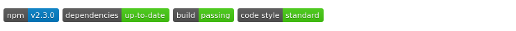

# HTTP Headers Security

Developing web applications means that our program depends on communication protocols which have already a set of standards defined and implemented for how to transfer data and how to manage it.

Browsers utilize HTTP headers to enforce and confirm such communication standards as well as security policies. Making use of these HTTP headers to increase security for the code running on the browser client-side is a quick and efficient method to mitigate security vulnerabilities and add defense in depth.

## Node.js Packages for HTTP Header Security

Responding to requests with security related HTTP headers is an HTTP concern and as such,
it may be employed with any web framework, or with the basic core http or https modules
which Node.js provide.

The [Helmet](https://github.com/helmetjs/helmet) library provides an easy abstraction,
and configuration for the various HTTP security headers that should be used and makes an
excellent choice for Node.js web applications based on Express.

### Helmet

[Helmet](https://github.com/helmetjs/helmet) is an application-level middleware for ExpressJS, providing widespread support for HTTP security headers, such as `X-XSS-Protection` to mitigate various browser related Cross-Site-Scripting (XSS) security vulnerabilities, X-Frame-Options protection and many others.



Helmet, being a collection of middleware functions for increased HTTP headers security, is well maintained and kept up to date. As such, it makes it a good choice to incorporate in your
Node.js web applications.

I> # More on Helmet
I>
I> Helmet has been around since 2012 and is considered mature and production-ready with stable releases and adoption by many frameworks and Node.js projects.
I> It is mainly developed by Evan Hahn, and Adam Baldwin who maintain hundreds of npm packages in the registry between them.

Helmet works by introducing middleware functions for ExpressJS that reply to incoming requests with a set of headers.

{pagebreak}

## Strict Transport Security

Strict Transport Security, also known as HSTS, is a protocol standard to enforce secure connections to the server via HTTP over SSL/TLS. HSTS is configured and transmitted from the server to any HTTP web client using the HTTP header _Strict-Transport-Security_ which specifies a time interval during which the browser should only communicate over an HTTP secured connection (HTTPS).

T> ## Tip
T>
T> When a _Strict-Transport-Security_ header is sent over an insecure HTTP connection the web browser ignores it because the connection is insecure to begin with.

### The Risk

The risks that may arise when communicating over a secure HTTPS connection is that a malicious user can perform a Man-In-The-Middle (MITM) attack and down-grade future requests to the web server to use an HTTP connection, thus being able to sniff and read all the data that flows through.

I> ## Interesting fact:
I> The [original HSTS draft](https://tools.ietf.org/html/rfc6797) was published in 2011 by Jeff Hodges from PayPal,
I> Collin Jackson from Carnegie Mellon University, and Adam Barth from Google.
I>

Sending insecure HTTP requests to the web server, even though an HTTPS connection was initially made is not a problem on its own, as the user is unaware of why this is happening and wouldn't necessarily suspect a MITM attack. Perhaps the server has a REST endpoint which does not yet support HTTPS.

In the following flow diagram, _Figure 1-1_, we can see an example scenario where the server returns an HTML file for the login page to the browser, which includes some resources that are accessible over HTTP (`http://cdn.server.com/images/submit.png`), like the submit button's image.

If an attacker is able to perform a Man-In-The-Middle attack and "sit on the wire" to listen and sniff any un-encrypted traffic that flows through, then they can access and read those HTTP requests which may include sensitive data. Even worse scenarios may include HTTP resources set for POST or PUT endpoints where actual data is being sent and can be sniffed.


### The Solution

When web servers want to protect their web clients through a secured HTTPS connection, they need to send the _Strict-Transport-Security_ header with a given value which represents the duration of time in seconds for which the web client should send future requests over a secured HTTPS connection.

e.g. to instruct the browser to upgrade all requests sent to the server to HTTPS for the next hour:

```
Strict-Transport-Security: max-age=3600
```

### Helmet Implementation

To use Helmet's HSTS library we need to download the npm package and we will also add it as a package dependency to the Node.js project we're working on:

```bash
npm install helmet --save
```

Let's setup the `hsts` middleware to indicate to a web client such as a browser that it should only send HTTPS requests to our server's hostname for the next month:

```js
const helmet = require("helmet");

// Set the expiration time of HTTPS requests to the
// server to 1 month, specified in milliseconds
const reqDuration = 2629746000;

app.use(
  helmet.hsts({
    maxAge: reqDuration,
  })
);
```

In the above snippet, we instruct the ExpressJS `app` to use the `hsts` library.

It is common for web servers to have sub-domains to fetch assets from, or make REST API calls to, in which case we would also like to protect them and enforce HTTPS requests. To do that, we can include the following optional parameter to the `hsts` options object:

```js
includeSubDomains: true;
```

### Lusca Implementation

If Lusca is not yet installed we can install it with npm as follows:

```bash
npm install lusca --save
```

Once lusca is installed, we can set it up for HSTS support with an ExpressJS application setup:

```js
var lusca = require("lusca");

// Set the expiration time of HTTPS requests to the server to 1 month,
// specified in milliseconds
var reqDuration = 2629746000;

app.use(
  lusca({
    hsts: {
      maxAge: requestsDuration,
    },
  })
);
```

As can be seen, using lusca is very similar to using helmet, including their optional arguments like `maxAge`, and `includeSubDomains`.

{pagebreak}

## X-Frame-Options

The [X-Frame-Options](http://tools.ietf.org/html/7034) HTTP header was introduced to mitigate an attack called Clickjacking which allows an attacker to disguise page elements such as buttons, and text inputs by hiding their view behind real web pages which render on the screen using an iframe HTML element, or similar objects.

I> ## Deprecation notice
I> The X-Frame-Options header was never standardized as part of an official specification but many of the popular browsers today still support it.
I> It's successor is the Content-Security-Policy header which will be covered in the next section and one should focus on implementing CSP for new websites being built.

### The Risk

The [Clickjacking](https://www.owasp.org/index.php/Clickjacking) attack is about mis-leading the user to perform a seemingly naive and harmless operation while in reality the user is clicking buttons of other elements or typing text into an input field which is under the user's control.

Common examples of employing Clickjacking attack:

1. If a bank, or email account website doesn't employ an X-Frame-Options HTTP header then a malicious attacker can render them in an iframe, and place the attacker's own input fields on the exact location of the bank or email website's input for username and password and to record your credentials information.
2. A web application for video or voice chat that is insecure can be exploited by this attack to let the user mistakenly assume they are just clicking around on the screen, or playing a game, while in reality the series of clicks is actually turning on your web camera or microphone.

### The Solution

To mitigate the problem, a web server can respond to a browser's request with an `X-Frame-Options` HTTP header which is set to one of the following possible values:

1. DENY - Specifies that the website can not be rendered in an iframe, frame, or object HTML elements.
2. SAMEORIGIN - Specifies that the website can be rendered only if it is requested to be embedded on an iframe, frame or object HTML elements from the same domain.
3. ALLOW-FROM <URI> - Specifies that the website can be framed and rendered from the provided URI value. It is important to note that you can't specify multiple URI values, but are limited to just one.

A few examples to show how this header is set are:

```
X-Frame-Options: ALLOW-FROM http://www.mydomain.com
```

and

```
X-Frame-Options: DENY
```

T> ## Beware of Proxies
T>
T> Web proxies are often used as a means of caching and they natively perform a lot of header manipulation.
T> Beware of proxies which might remove this or other security related headers.

### Helmet Implementation

With helmet, implementing this header is as simple as requiring the helmet package and using ExpressJS's `app` object to instruct ExpressJS to use the xframe middleware provided by helmet.

To set the X-Frame-Options to completely deny any frames:

```js
var helmet = require("helmet");

app.use(
  helmet.frameguard({
    action: "deny",
  })
);
```

Similarly, we can allow frames to occur only from the same origin by providing the following object:

```js
{
  action: "sameorigin";
}
```

Or to allow frames to occur from a specified host:

```js
{
  action: 'allow-from',
  domain: 'https://mydomain.com'
}
```

### Lusca Implementation

If the lusca library is already installed and our ExpressJS application is already configured and provides the `app` object, then:

```js
var lusca = require("lusca");

app.use(
  lusca({
    xframe: "SAMEORIGIN",
  })
);
```

{pagebreak}

## Content-Security-Policy

As reviewed before with the X-Frame-Options header, there are many attacks related to content injection in the user's browser whether it is the Clickjacking attack, or other forms of attack such as Cross-Site-Scripting (XSS).

Another improvement to the previous set of headers is a header which can tell the browser which content to trust so that the browser is able to prevent attempts to disable malicious content injection that is specified not to be trusted by web servers.

With [Content-Security-Policy](https://developer.mozilla.org/en-US/docs/Web/Security/CSP/Introducing_Content_Security_Policy) (CSP) it is possible to prevent a wide range of attacks, including Cross-site scripting and other content injections, including Clickjacking which we have already reviewed and in this regard the implementation of CSP renders the use of the X-Frame-Options header obsolete.

### The Risk

By default, the CSP header will prevent and mitigate several issues such as:

- Inline JavaScript code specified with `<script>` tags, and any DOM events which trigger JavaScript execution such as `onClick()` etc.
- Inline CSS code specified via a `<style>` tag or attribute elements

### The Solution

With CSP we can whitelist many configurations for trusted content and as such the initial setup can grow to a set of complex directives.
Let's review one directive called _connect-src_. It is used to control which remotes the browser is allowed to connect to via XHR, or WebSockets.
Acceptable values that we can set for this or other directives are:

- _'none'_ - not allowing remote calls such as XHR at all
- _'self'_ - only allow remote calls to our own domain (an exact domain/hostname. sub-domains aren't allowed)

An example for this directive being set by the web server and allows remote calls only to our own domain and to Google's API domain:

```
Content-Security-Policy: connect-src 'self' https://apis.google.com;
```

Another directive to control the whitelist for JavaScript sources is called _script-src_.
This directive helps mitigate Cross-Site-Scripting (XSS) attacks by instructing the browser what is a valid source for evaluating and executing JavaScript source code.

_script-src_ supports the _'none'_ and _'self'_ keywords as values and includes the following options:

- _'unsafe-inline'_ - allow any inline JavaScript source code such as `<script>`, and DOM events triggering like `onClick()`, or `javascript:` URIs. It also affects CSS for inline tags.
- _'unsafe-eval'_ - allow execution of code using `eval()`

For example, a policy for allowing JavaScript to be executed only from our own domain and from Google's, and allows inline JavaScript code as well:

```
Content-Security-Policy: script-src 'self' https://apis.google.com 'unsafe-inline'
```

A full list of supported directives can be found on the [CSP policy directives page on MDN](https://developer.mozilla.org/en-US/docs/Web/Security/CSP/CSP_policy_directives) but let's cover some other common options and their values.

- _default-src_ - where a directive doesn't have a value, it defaults to an open, non-restricting configuration. It is safer to set a default for all of the un-configured options and this is the purpose of the _default-src_ directive.
- _script-src_ - a directive to set which locations we allow to load or execute JavaScript sources from. If it's set to a value of _'self'_ then no inline JavaScript tags are allowed, such as `<script>`, and only sources from our own domain.

I> ## On implementing CSP
I> It should also be noted that the CSP configuration needs to meet the implementation of your web application architecture so that if you
I> deny inline <script> blocks then your R&D team is aware of this and do not rely on such inline JavaScript code blocks, otherwise you will be
I> breaking features and functionality.

### Helmet Implementation

Using helmet we can configure a secured policy for trusted content.
Due to the potential for a complex configuration we will review several different policies in smaller blocks of code to easily explain what is happening when we implement CSP.

The following Node.js code will add helmet's CSP middleware on each request so that the server responds with a CSP header and a simple security policy.

We define a whitelist where JavaScript code and CSS resources are only allowed to be loaded from the current origin, which is the exact hostname or domain (no sub-domains will be allowed):

```js
var helmet = require("helmet");

app.use(
  helmet.contentSecurityPolicy({
    directives: {
      scriptSrc: ["'self'"],
      styleSrc: ["'self'"],
    },
  })
);
```

It is important to remember that if no default policy is specified then all other types of content policies are open and allowed, and also some content policies simply don't have a default and must be specified to be overridden.

Let's construct the following content policy for our web application:

- By default, allow resources to be loaded only from our own domain origin, or from our Amazon CDN.
- JavaScript sources are restricted to our own domain and Google's hosted libraries domain so we can load AngularJS from Google.
- Because our web application doesn't need any kind of iframes, or objects to be embedded and rendered we will disable them.
- Forms are always only submitted to our own domain origin.

```js
var helmet = require("helmet");

app.use(
  helmet.contentSecurityPolicy({
    directives: {
      defaultSrc: ["'self'", "https://cdn.amazon.com"],
      scriptSrc: ["'self'", "https://ajax.googleapis.com"],
      childSrc: ["'none'"],
      objectSrc: ["'none'"],
      formAction: ["'none'"],
    },
  })
);
```

### Lusca Implementation

Lusca's CSP option has three main objects that can be set:

- `policy` - an object for defining the content policy
- `reportOnly` - a true or false for defining whether the browser should only report violations of the content policy or actually deny such attempts
- `reportUri` - the URI string to send reporting data as JSON documents via POST requests being made from the browser

With this simple setup constructing a content policy is very similar to the official documentation with regards to directives and their values.

For example, let's setup the following content policy:

- Allow by default content only from our own origin domain, and from https://ajax.googleapis.com
- For any content violations just report the error, don't actually deny requests from being sent
- For any content violations send a report to a remote system

```js
var lusca = require("lusca");

app.use(
  lusca.csp({
    policy: {
      "default-src": "'self' https://ajax.googleapis.com",
    },
    reportOnly: true,
    reportUri: "https://mydomain.com/report",
  })
);
```

### Gradual CSP Implementation

Your Content Security Policy will grow and change as your web application grows too.
With the many varied directives it could be challenging to introduce a policy all at once so instead an incremental approach is recommended.

The CSP header has a built-in directive which helps in understanding how your web application makes use of content policy.
This directive is used for reporting any actions performed by the browser for any of the directives and the origins that they call.

It's simple to add to any running web application:

```
Content-Security-Policy: default-src 'self'; report-uri https://mydomain.com/report
```

Once added, the browser will send a POST request to the URI provided with a JSON format in the body for anything that violates the content security policy of serving content from our own origin domain where the page is served.

With Helmet this is easily configured:

```js
var helmet = require("helmet");

app.use(
  helmet.csp({
    directives: {
      defaultSrc: ["self"],
      reportUri: "https://mydomain.com/report",
    },
  })
);
```

Another useful configuration for helmet when we are still evaluating is to instruct the browser to only report on content policy violation and not block them:

```js
var helmet = require("helmet");

app.use(
  helmet.csp({
    directives: {
      defaultSrc: ["self"],
      reportUri: "https://mydomain.com/report",
    },
    reportOnly: true,
  })
);
```

{pagebreak}

## Other HTTP headers

Some other non-standard HTTP headers exist which are not part of any official specification such as IANA, but are worth looking into as they do provide another layer of security for your users.

### X-XSS-Protection

The HTTP header _X-XSS-Protection_ is used by IE8 and IE9 and allows toggling on or off the Cross-Site-Scripting (XSS) filter capability that is built into the browser.

Turning XSS filtering on for any IE8 and IE9 browsers rendering your web application requires the following HTTP header to be sent:

```
X-XSS-Protection: 1; mode=block
```

With Helmet, this protection can be turned on using the following snippet:

```js
var helmet = require("helmet");

app.use(helmet.xssFilter());
```

With Lusca, this is quite simple as well:

```js
var lusca = require("lusca");

app.use(lusca.xssProtection(true));
```

### X-Content-Type-Options

The _X-Content-Type-Options_ HTTP header is used by IE, Chrome, and Opera and is used to mitigate a MIME based attack.

The purpose of this header is to instruct the browser to not sniff override the web server's content type and render the stream as it is sent from the server.

An example of setting this header:

```
X-Content-Type-Options: nosniff
```

Helmet's implementation:

```js
var helmet = require("helmet");

app.use(helmet.noSniff());
```

Lusca has no support for this HTTP header built in.

{pagebreak}

## Summary

In this chapter we dived into the world of security by implementing HTTP headers for increased security.
We learned about Helmet, and Lusca Node.js libraries which can be easily added to any ExpressJS project and quickly configured to provide additional security.

The HTTP security headers that we reviewed are:

- Strict Transport Security
- X Frame Options
- Content Security Policy
- X XSS Protection
- X Content Type Options
